# create_scene — End-to-End Flow

```mermaid
flowchart TD
    classDef phase fill:#e8f4fd,stroke:#2196F3,stroke-width:2px,color:#1565C0
    classDef tool fill:#fff3e0,stroke:#FF9800,stroke-width:2px,color:#E65100
    classDef llm fill:#f3e5f5,stroke:#9C27B0,stroke-width:2px,color:#6A1B9A
    classDef guard fill:#fce4ec,stroke:#E91E63,stroke-width:2px,color:#880E4F
    classDef output fill:#e8f5e9,stroke:#4CAF50,stroke-width:2px,color:#2E7D32
    classDef error fill:#ffebee,stroke:#f44336,stroke-width:2px,color:#c62828
    classDef trace fill:#f5f5f5,stroke:#9E9E9E,stroke-width:1px,color:#616161

    %% ── Ingress ──
    MSG["💬 User/Assistant Message<br/><i>conversationsPlugin</i>"]:::phase
    ORCH["🎭 characterRuntimeOrchestrator<br/><i>orchestrateCharacterRuntimeTurn()</i>"]:::phase

    MSG --> ORCH

    %% ── Routing ──
    INTENT["🧠 Intent Router (LLM)<br/><i>detectRuntimeIntentModelDecision()</i><br/>Model: gpt-4o-mini"]:::llm
    ORCH --> INTENT

    INTENT -->|"skillId = create_scene<br/>+ flags + toolIntent"| GUARD
    INTENT -->|"skillId = remember-something"| OTHER1["→ Memory-Recall-Flow"]:::trace
    INTENT -->|"skillId = request-context"| OTHER2["→ Context-Read-Flow"]:::trace
    INTENT -->|"decision = null"| FAIL_ROUTE["⚠️ Graceful Failure<br/><i>Unavailable-Message</i>"]:::error

    %% ── Guardrails ──
    GUARD{"🛡️ shouldExecuteCreateScene()<br/><i>Regex-Guard auf User-Text</i>"}:::guard
    GUARD -->|"✅ Action-Verb erkannt"| EXEC
    GUARD -->|"❌ Kein Scene-Flow-Trigger"| FAIL_GUARD["⚠️ Scene-Flow blockiert<br/><i>Unavailable-Message</i>"]:::error

    %% ── Skill Execution ──
    EXEC["⚡ executeRoutedSkill()<br/><i>skillId = 'create_scene'</i>"]:::phase

    %% ── Phase 1: Story-Kontext laden ──
    subgraph CTX ["Phase 1 — Story-Kontext aufbauen"]
        direction TB
        T1["📖 read_activities<br/><i>Story-Summaries + letzte Szenen</i>"]:::tool
        T1 --> FILTER["Filter: STORYBOOK_ACTIVITY_TYPES<br/><i>image.generated / image.recalled</i>"]:::trace
        FILTER --> HISTORY["buildStoryHistoryContext()<br/><i>what happened · scene before · last scene</i>"]:::trace
    end

    EXEC --> CTX

    %% ── Phase 2: Beziehungen + Objekte laden ──
    subgraph REL ["Phase 2 — Beziehungen & Objekte"]
        direction TB
        T2["🔗 read_relationships"]:::tool
        T2 --> T3["🧩 read_related_objects<br/><i>Characters, Places, Items</i>"]:::tool
        T3 --> MENTIONED["collectMentionedRelatedObjects()<br/><i>User-Text + letzte Szene scannen</i>"]:::trace
        MENTIONED --> T4["🔍 read_related_object_contexts<br/><i>bis zu 4 erwähnte Objekte</i>"]:::tool
    end

    CTX --> REL

    %% ── Phase 3: Szene planen ──
    subgraph SCENE ["Phase 3 — Nächste Szene planen"]
        direction TB
        IMG_REFS["resolveCharacterImageRefs()<br/><i>Hauptfigur-Bildpfade laden</i>"]:::trace
        IMG_REFS --> GROUND1["selectGroundedSceneCharacters()<br/><i>provisorisch: wer ist in der Szene?</i>"]:::trace
        GROUND1 --> SUMMARY["🧠 generateNextSceneSummary()<br/><i>LLM erzeugt kindgerechte<br/>Szenen-Beschreibung</i>"]:::llm
        SUMMARY --> GROUND2["selectGroundedSceneCharacters()<br/><i>final: Szene-Summary als Basis</i>"]:::trace
        GROUND2 --> PROMPT["buildNextSceneImagePrompt()<br/><i>Bild-Prompt aus Summary +<br/>grounded Characters</i>"]:::trace
    end

    REL --> SCENE

    %% ── Phase 4: Bild generieren ──
    subgraph GEN ["Phase 4 — Bild erzeugen"]
        direction TB
        T5["🎨 generate_image<br/><i>generateConversationHeroToolApi()</i><br/>sceneSummary + scenePrompt +<br/>referenceImages + relatedCharacters"]:::tool
        T5 --> ACTIVITY["📝 createActivity()<br/><i>conversation.scene.directed</i><br/>Szene + Bild in Activity-Store"]:::output
    end

    SCENE --> GEN

    %% ── Optionale Nebenläufe ──
    subgraph OPT ["Optional — Nebenläufe"]
        direction LR
        QUIZ{"shouldRunQuiz()?"}:::guard
        QUIZ -->|"Ja"| QUIZ_RUN["🎲 run_quiz<br/><i>runConversationQuizSkill()</i>"]:::tool
        CLI{"toolExecutionIntent?"}:::guard
        CLI -->|"Ja"| CLI_RUN["⚙️ run_cli_task<br/><i>Allowlisted CLI-Task</i>"]:::tool
    end

    GEN --> OPT

    %% ── Abschluss ──
    OPT --> DONE["✅ Skill-Execution abgeschlossen<br/><i>trace.skill.execution.response</i>"]:::output

    %% ── Fehler ──
    EXEC -.->|"catch"| ERR["❌ Fehler<br/><i>Unavailable-Message +<br/>Error-Trace</i>"]:::error
```

## Phasen-Uebersicht

| Phase | Was passiert | Tools / LLM |
|-------|-------------|-------------|
| **Ingress** | Nachricht kommt via `conversationsPlugin` an | — |
| **Routing** | LLM klassifiziert Intent → `create_scene` | `intentRouter` (gpt-4o-mini) |
| **Guard** | Regex prueft, ob User wirklich eine Scene-Action will | `shouldExecuteCreateScene()` |
| **Phase 1** | Story-Kontext laden: Summaries, letzte Szenen | `read_activities` |
| **Phase 2** | Beziehungen, Figuren, Orte, Objekte nachladen | `read_relationships`, `read_related_objects`, `read_related_object_contexts` |
| **Phase 3** | Naechste Szene planen: Characters grounding, LLM-Summary, Bild-Prompt | `generateNextSceneSummary` (LLM), `selectGroundedSceneCharacters`, `buildNextSceneImagePrompt` |
| **Phase 4** | Bild generieren und Activity speichern | `generate_image`, `createActivity` |
| **Optional** | Quiz starten oder CLI-Task ausfuehren | `run_quiz`, `run_cli_task` |

## Datenfluss-Highlights

- **Story-History** fliesst als `{ whatHappenedSoFar, previousScene, latestScene }` in die Szenen-Planung.
- **Grounded Characters** werden zweimal berechnet: provisorisch (User-Request) und final (generierte Summary).
- **Reference-Images** (bis zu 8) sichern visuelle Konsistenz beim Bild-Generieren: letzte 2 Szenen-Bilder + Standard-Figur-Bilder aller beteiligten Characters.
- **Tracing** laeuft durchgehend ueber `trackTraceActivitySafely()` — jeder Schritt wird als Activity geloggt.
